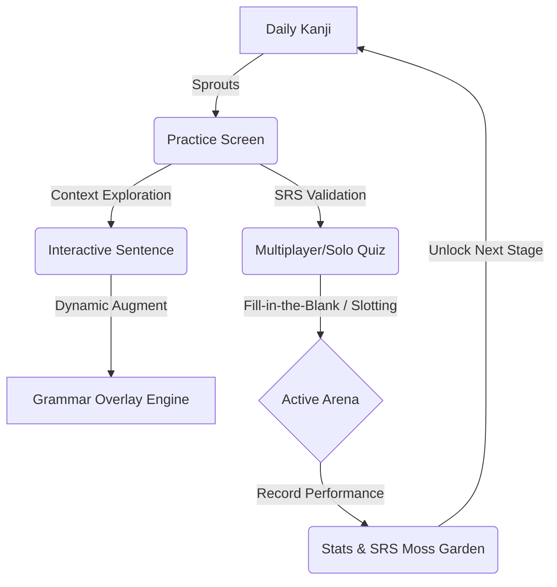
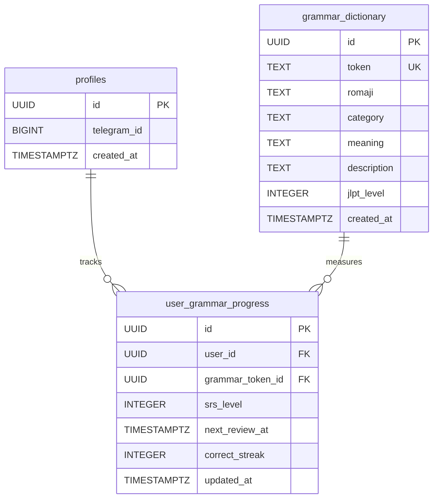
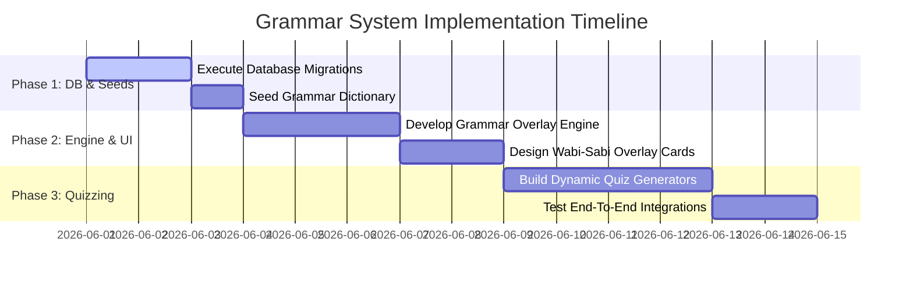

# Japanese Grammar Learning Architecture & UX Proposal
*A Wabi-Sabi Aligned Pedagogical System for Kanji Dojo*

---

> [!NOTE]
> This proposal presents a comprehensive architectural and user-experience plan for integrating JLPT N5 and N4 Japanese grammar (particles, prefixes, suffixes, and conjugations) into Kanji Dojo's core gameplay loop. It establishes a resilient bridge between LLM-generated sentences and hand-curated pedagogical data.

---

## 1. UX Architecture & The Wabi-Sabi Philosophy

In traditional Japanese aesthetics, **Wabi-Sabi (侘寂)** finds beauty in simplicity, transience, and the organic marks of craftsmanship. Learning Japanese grammar should not feel like analyzing a mechanical flowchart; it should feel like tracing a stream of thought, observing how particles and verb endings steer the flow of meaning.

We avoid clinical tables and dense walls of text in favor of three wabi-sabi principles:
*   **Kanso (簡素 - Simplicity):** Grammar is taught *implicitly* in context. Rules are discovered by interacting with example sentences, not by reading long reference articles.
*   **Shizen (自然 - Naturalness):** Example sentences represent fluid, organic daily Japanese. Particles are treated as the "joints" of the sentence.
*   **Shibui (渋味 - Elegant Patina):** Grammar progression is tracked as the cultivation of a stone and moss garden, where SRS reviews gradually build a sense of time, quiet discipline, and calm mastery.



### The Core Loop Integration

1.  **Daily Kanji (The Anchor):** Each active Kanji serves as a root. The vocabulary and sentences spawned by it introduce grammar constructs naturally. For example, learning **食** (to eat) anchors the grammar of `〜ました` (past polite) and the direct object particle `を`.
2.  **Practice (Interactive Sentence Garden):**
    *   Example sentences are presented as a calligraphic ink flow. 
    *   Grammatical tokens (particles, conjugations) are marked with a warm, clay/terracotta-colored dashed underline (`border-bottom: 1.5px dashed var(--clay)`), distinguishing them from vocabulary.
    *   Tapping a grammatical token triggers a smooth parchment-colored drawer (slide-in from bottom) containing its semantic "essence" and role in the sentence.
3.  **Quiz (Grammar Slotting in the Arena):**
    *   **Particle Slotting (Fill-in-the-Blank):** A sentence from learned Kanjis is drawn with a particle removed (e.g. `一日は二十四時間___です。`). The options are known particles (`は`, `に`, `が`, `を`).
    *   **Conjugation Choice:** Choose the correct verb suffix to complete the sentence (e.g., matching the past tense `ました` with "yesterday" cues in the English translation).
4.  **Stats (The Moss Garden of Mastery):**
    *   SRS progress for grammatical elements is displayed as quiet stones in a Karesansui (sand garden). As SRS levels increase, soft moss covers the stones, symbolizing structural stability in memory.

---

## 2. Real-Time Client-Side Grammar Overlay Engine

A critical issue in modern language-learning apps is the discrepancy between LLM-generated example sentences (which may omit grammar explanations or have blank token fields) and structured dictionaries.

We will introduce a client-side **Grammar Overlay Engine** inside `InteractiveSentence.tsx` that intercepts clicked tokens and performs a real-time, zero-latency lookup against a pre-loaded local or client-cached grammar dictionary.

### The Problem: Schema Discrepancy & Blank Fields
*   **Schema Mismatch:** Hand-seeded data (`seed-kanji.ts`) uses `{ word, reading, meaning }`. AI-harvested data (`harvest-n5.ts`) uses `{ text, furigana, english }`.
*   **Grammar Gaps:** LLMs are prone to leaving `english` or `grammar_explanation` blank or `null` for particles like `は` or verb conjugations like `ました`.

### The Solution: The Augmented Parsing Hook
Whenever a user interacts with a sentence token, we map the token properties defensively and overlay detailed descriptions if the clicked token is a known grammatical construct.

```typescript
// components/InteractiveSentence.tsx

export interface Token {
  text?: string;
  word?: string; // DB compatibility
  furigana?: string;
  reading?: string; // DB compatibility
  english?: string;
  meaning?: string; // DB compatibility
  grammar_explanation?: string;
}

// Local cache loaded once on application mount or server-side pre-fetch
export interface GrammarDictEntry {
  romaji: string;
  category: 'particle' | 'suffix' | 'prefix' | 'conjugation';
  meaning: string;
  description: string;
}

export const localGrammarDict: Record<string, GrammarDictEntry> = {
  // Seeds are pre-populated here for instant fallback
  "は": { romaji: "wa", category: "particle", meaning: "Topic marker", description: "Marks the main topic of the sentence. Pronounced 'wa'." },
  "が": { romaji: "ga", category: "particle", meaning: "Subject marker", description: "Identifies the specific subject performing the action." },
  "を": { romaji: "o", category: "particle", meaning: "Direct object marker", description: "Links the action verb to the direct object that receives it." },
  "に": { romaji: "ni", category: "particle", meaning: "Target / Time / Place", description: "Indicates destination, specific time, or indirect object." },
  "の": { romaji: "no", category: "particle", meaning: "Possessive / Linker", description: "Connects nouns to show possession or modification." },
  "で": { romaji: "de", category: "particle", meaning: "Location / Instrument", description: "Marks where an action takes place or the means used to perform it." },
  "から": { romaji: "kara", category: "particle", meaning: "From / Because", description: "Indicates a starting point or a causal reason." },
  "まで": { romaji: "made", category: "particle", meaning: "Until / As far as", description: "Specifies a terminal boundary in space or time." },
  "て": { romaji: "te", category: "conjugation", meaning: "Te-form / Request / Linker", description: "Conjunctive verb suffix used to link clauses or request action." },
  "ました": { romaji: "mashita", category: "conjugation", meaning: "Past polite verb suffix", description: "Polite past tense suffix added to verb stems." },
  "ない": { romaji: "nai", category: "conjugation", meaning: "Negative plain verb suffix", description: "Conjugates a verb into its casual, plain negative state." },
  "ください": { romaji: "kudasai", category: "suffix", meaning: "Please (request)", description: "Polite suffix added after the te-form to request something." }
};

/**
 * Defensive Normalization & Dynamic Enrichment Engine
 */
export function useEnrichedToken(token: Token) {
  const text = token.text || token.word || '';
  const furigana = token.furigana || token.reading || '';
  let english = token.english || token.meaning || '';
  let grammarExplanation = token.grammar_explanation || '';

  // Check if this token is a pre-seeded grammar construct
  const lookupKey = text.trim();
  const grammarInfo = localGrammarDict[lookupKey];

  if (grammarInfo) {
    // If the token lacks explanation, supplement it with pre-seeded masterclass details
    if (!english || english.toLowerCase() === 'null') {
      english = grammarInfo.meaning;
    }
    if (!grammarExplanation) {
      grammarExplanation = grammarInfo.description;
    }
  }

  return {
    text,
    furigana,
    english,
    grammar_explanation: grammarExplanation,
    isGrammar: !!grammarInfo,
    category: grammarInfo?.category || null
  };
}
```

---

## 3. Database Schema Evolution

To scale from isolated particles to a complete curriculum, we evolve the simple `particles` dictionary table into a unified `grammar_dictionary` table and introduce a `user_grammar_progress` table to power our implicit SRS model.



### Safe Supabase SQL Migration Script

Below is the DDL required to safely transition the database. It preserves pre-existing records and builds the new schema seamlessly.

```sql
-- =====================================================================
-- KANJI DOJO — GRAMMAR UPGRADE MIGRATION (Idempotent)
-- =====================================================================

BEGIN;

-- 1. Rename 'particles' to 'grammar_dictionary' safely if it exists
DO $$
BEGIN
    IF EXISTS (SELECT 1 FROM information_schema.tables WHERE table_schema = 'public' AND table_name = 'particles') THEN
        ALTER TABLE public.particles RENAME TO grammar_dictionary;
        ALTER TABLE public.grammar_dictionary RENAME COLUMN particle TO token;
    END IF;
END $$;

-- 2. Ensure table exists with evolved structure
CREATE TABLE IF NOT EXISTS public.grammar_dictionary (
    id          UUID PRIMARY KEY DEFAULT uuid_generate_v4(),
    token       TEXT NOT NULL UNIQUE,
    romaji      TEXT NOT NULL,
    category    TEXT NOT NULL CHECK (category IN ('particle', 'suffix', 'prefix', 'conjugation')),
    meaning     TEXT NOT NULL,
    description TEXT,
    jlpt_level  INTEGER DEFAULT 5,
    created_at  TIMESTAMPTZ DEFAULT timezone('utc'::text, now()) NOT NULL
);

-- 3. Add category and jlpt_level column if they don't exist (in case rename occurred)
ALTER TABLE public.grammar_dictionary ADD COLUMN IF NOT EXISTS category TEXT NOT NULL DEFAULT 'particle' CHECK (category IN ('particle', 'suffix', 'prefix', 'conjugation'));
ALTER TABLE public.grammar_dictionary ADD COLUMN IF NOT EXISTS jlpt_level INTEGER DEFAULT 5;

-- 4. Create user_grammar_progress table for SRS tracking
CREATE TABLE IF NOT EXISTS public.user_grammar_progress (
    id               UUID PRIMARY KEY DEFAULT uuid_generate_v4(),
    user_id          UUID REFERENCES public.profiles(id) ON DELETE CASCADE NOT NULL,
    grammar_token_id UUID REFERENCES public.grammar_dictionary(id) ON DELETE CASCADE NOT NULL,
    srs_level        INTEGER DEFAULT 0,
    next_review_at   TIMESTAMPTZ NOT NULL DEFAULT NOW(),
    correct_streak   INTEGER DEFAULT 0,
    updated_at       TIMESTAMPTZ DEFAULT NOW(),
    UNIQUE (user_id, grammar_token_id)
);

-- 5. Enable Row Level Security (RLS)
ALTER TABLE public.grammar_dictionary ENABLE ROW LEVEL SECURITY;
ALTER TABLE public.user_grammar_progress ENABLE ROW LEVEL SECURITY;

-- 6. DDL RLS Policies
DROP POLICY IF EXISTS "Public read access for grammar_dictionary" ON public.grammar_dictionary;
CREATE POLICY "Public read access for grammar_dictionary"
    ON public.grammar_dictionary FOR SELECT USING (true);

DROP POLICY IF EXISTS "Users can select their own grammar progress" ON public.user_grammar_progress;
CREATE POLICY "Users can select their own grammar progress"
    ON public.user_grammar_progress FOR SELECT USING (user_id = auth.uid());

DROP POLICY IF EXISTS "Users can insert their own grammar progress" ON public.user_grammar_progress;
CREATE POLICY "Users can insert their own grammar progress"
    ON public.user_grammar_progress FOR INSERT WITH CHECK (user_id = auth.uid());

DROP POLICY IF EXISTS "Users can update their own grammar progress" ON public.user_grammar_progress;
CREATE POLICY "Users can update their own grammar progress"
    ON public.user_grammar_progress FOR UPDATE USING (user_id = auth.uid());

-- Indexes for lightning-fast queries
CREATE INDEX IF NOT EXISTS idx_grammar_dict_token ON public.grammar_dictionary (token);
CREATE INDEX IF NOT EXISTS idx_user_grammar_srs ON public.user_grammar_progress (user_id, next_review_at);

COMMIT;
```

---

## 4. Masterclass Japanese Grammar Seed Dataset

Below is the definitive, hand-curated pedagogical data list for JLPT N5 and N4 levels. This should be seeded into `grammar_dictionary` to guarantee 100% explanatory coverage for particles, prefixes, suffixes, and conjugations.

### Seed Insert Script (Idempotent)

```sql
INSERT INTO public.grammar_dictionary (token, romaji, category, meaning, description, jlpt_level) VALUES
-- --- N5 Particles ---
('は', 'wa', 'particle', 'Topic Marker', 'Marks the main topic of the sentence. Pronounced as "wa" but written with hiragana "ha". Sets the context.', 5),
('が', 'ga', 'particle', 'Subject Marker', 'Marks the specific subject of the sentence, often introducing new information or emphasizing WHO performed the action.', 5),
('を', 'wo', 'particle', 'Direct Object Marker', 'Indicates the direct object of a transitive action verb. Written as "wo" but pronounced "o" in modern speech.', 5),
('に', 'ni', 'particle', 'Destination / Time / Indirect Object', 'Marks destination of movement (to), specific points in time (at/on), and recipients of actions.', 5),
('へ', 'e', 'particle', 'Direction Marker', 'Emphasizes the general direction of movement (towards). Written as "he" but pronounced "e".', 5),
('で', 'de', 'particle', 'Location of Action / Instrument', 'Marks where an action takes place, or the tool/instrument/method used to complete an action.', 5),
('と', 'to', 'particle', 'And / With (Exhaustive)', 'Joins nouns together to form a complete, exhaustive list ("and"), or indicates accompaniment ("with").', 5),
('や', 'ya', 'particle', 'And (Non-Exhaustive list)', 'Links nouns to list representative examples, implying there are other unlisted items in the group.', 5),
('の', 'no', 'particle', 'Possession / Linker', 'Indicates ownership ("s") or links nouns together, where the first noun modifies the second.', 5),
('から', 'kara', 'particle', 'From / Starting Point / Because', 'Indicates a starting point in time/space ("from"), or specifies the reason or cause ("because") when ending a clause.', 5),
('まで', 'made', 'particle', 'Until / Limit', 'Indicates a boundary or terminal limit in space or time ("until", "as far as").', 5),
('も', 'mo', 'particle', 'Also / Too', 'Replaces particles は, が, or を to indicate that the same statement applies to another subject/object ("also").', 5),
('ね', 'ne', 'particle', 'Sentence Ending: Seeking Agreement', 'Placed at the end of a sentence to seek agreement, reassurance, or build rapport ("right?", "isn''t it?").', 5),
('よ', 'yo', 'particle', 'Sentence Ending: Assurance / Emphasis', 'Used at the end of a sentence to offer new info, assert certainty, or emphasize a statement.', 5),
('か', 'ka', 'particle', 'Question Marker', 'Placed at the end of a sentence to mark a question. Replaces the question mark.', 5),

-- --- N4 Particles ---
('だけ', 'dake', 'particle', 'Only / Just', 'Indicates a limit, specifying that nothing else is included. Replaces or attaches directly to nouns.', 4),
('ばかり', 'bakari', 'particle', 'Nothing But / Just Finished', 'Indicates that something is done exclusively ("nothing but") or that an action has literally just finished (past tense + bakari).', 4),
('しか', 'shika', 'particle', 'Only (Used with Negative)', 'Means "only" or "nothing but". Always paired with a negative verb to express limitation with a nuanced tone of insufficiency.', 4),
('でも', 'demo', 'particle', 'But / Even / Or something', 'Translates to "even if" or "but". When attached to a noun, it suggests it as an example ("or something like that").', 4),
('ながら', 'nagara', 'particle', 'While / Doing Simultaneously', 'Attached to verb stem to indicate that two actions are performed simultaneously by the same subject.', 4),
('より', 'yori', 'particle', 'Than (Comparison)', 'Used in comparison statements, marking the standard or baseline of comparison ("more than X").', 4),
('ほど', 'hodo', 'particle', 'Extent / Degree / Limit', 'Specifies the approximate degree or extent of something ("as much as", "to the extent of").', 4),
('ぐらい', 'gurai', 'particle', 'Approximate Amount / Degree', 'Indicates an approximate duration, quantity, or level ("about", "around"). Also written "kurai".', 4),
('までに', 'made ni', 'particle', 'By / Before (Deadline)', 'Marks a deadline by which an action must be completed ("by", "no later than"). Distinct from until (made).', 4),
('ずつ', 'zutsu', 'particle', 'Each / At a Time', 'Marks distribution, indicating that a quantity is divided equally ("two each", "one at a time").', 4),

-- --- N5/N4 Prefixes & Suffixes ---
('お', 'o-', 'prefix', 'Polite Prefix (Wago)', 'Preposed to Japanese-origin nouns and adjectives to show respect or add refinement (e.g., お茶, お水).', 5),
('ご', 'go-', 'prefix', 'Polite Prefix (Kango)', 'Preposed to Chinese-origin compound nouns to show respect or add formal refinement (e.g., ご飯, ご連絡).', 5),
('たち', 'tachi', 'suffix', 'Plural Suffix for People', 'Sufixed to pronouns or nouns representing people to form a plural group (e.g., 私たち - we, 子供たち - children).', 5),
('方', 'kata', 'suffix', 'Way of doing / Method', 'Attached to the verb stem (masu-stem) to represent the method or manner of doing that action (e.g., 読み方 - way of reading).', 4),
('屋', 'ya', 'suffix', 'Shop / Store Suffix', 'Attached to a product name to denote the shop that sells it, or the person who runs it (e.g., 本屋 - bookstore).', 5),
('さ', 'sa', 'suffix', 'Noun-forming Adjective Suffix', 'Attached to adjective stems (removing -i or -na) to turn them into abstract nouns measuring degree (e.g., 高さ - height).', 4),
('人', 'jin / nin', 'suffix', 'Person / Nationality / Counter', 'As -jin, it indicates nationality (e.g. 日本人). As -nin, it counts people (e.g. 三人).', 5),
('回', 'kai', 'suffix', 'Counter for Occurrences', 'Counter suffix indicating the number of times an event happens (e.g. 一回 - once, 何回 - how many times).', 5),
('日', 'nichi / ka', 'suffix', 'Counter for Days', 'Sufixed to count days or denote dates of the month (e.g. 三日 - third day/three days).', 5),
('時', 'ji', 'suffix', 'Hour / O''clock Counter', 'Counter suffix used to indicate o''clock or hours (e.g. 三時 - 3 o''clock).', 5),

-- --- N5/N4 Verb Suffixes & Conjugations ---
('ました', 'mashita', 'conjugation', 'Past Polite Verb Suffix', 'Conjugates a verb into its polite, formal past tense (positive). Attached to verb stem.', 5),
('ません', 'masen', 'conjugation', 'Non-Past Negative Polite', 'Conjugates a verb into its polite, formal present/future negative form (e.g., 行きません - will not go).', 5),
('ませんでした', 'masendeshita', 'conjugation', 'Past Negative Polite', 'Polite, formal past negative verb ending (e.g., 食べませんでした - did not eat).', 5),
('ます', 'masu', 'conjugation', 'Polite Non-Past Verb Suffix', 'Standard polite, formal ending for present/future affirmative verbs.', 5),
('て', 'te', 'conjugation', 'Conjunctive / Request Form', 'The te-form suffix. Links verbs in sequence, indicates cause, or acts as a mild request when followed by kudasai.', 5),
('ない', 'nai', 'conjugation', 'Negative Plain Suffix', 'Conjugates a verb into its casual, plain present negative form. Act as an i-adjective structurally.', 5),
('たい', 'tai', 'conjugation', 'Desire Suffix (Want to)', 'Attached to the verb stem to express desire ("want to do"). Inflects exactly like an i-adjective.', 4),
('ましょう', 'mashou', 'conjugation', 'Polite Volitional (Let''s)', 'Polite suggestion or invitation ("let''s do X" or "shall I do X?"). Attached to verb stem.', 5),
('させる', 'saseru', 'conjugation', 'Causative Verb Suffix', 'Indicates that the subject makes or lets someone else perform an action (e.g., 行かせる - to make/let go).', 4),
('られる', 'rareru', 'conjugation', 'Passive / Potential Suffix', 'Conjugates Group 2 verbs into the passive ("to be done") or potential ("can do") form.', 4),
('ば', 'ba', 'conjugation', 'Conditional Suffix (If)', 'Forms a conditional statement ("if... then"). Attached to the e-column of verbs or adjectives.', 4),
('たら', 'tara', 'conjugation', 'Past Conditional (If / When)', 'Strong conditional/temporal suffix ("if" or "once action is completed"). Formed from past tense + ra.', 4),
('そう', 'sou', 'conjugation', 'Conjectural: Looks like / Hear that', 'Attached to adjective or verb stems to mean "looks like" (e.g., 美味しそう). Attached to plain form for hearsay.', 4),
('にくい', 'nikui', 'conjugation', 'Difficult to do Suffix', 'Attached to verb stem to indicate that performing the action is physically or mentally difficult.', 4),
('やすい', 'yasui', 'conjugation', 'Easy to do Suffix', 'Attached to verb stem to indicate that performing the action is simple or intuitive.', 4),
('ください', 'kudasai', 'suffix', 'Please Request Suffix', 'Added directly after the conjunctive te-form of a verb to formulate a polite request.', 5)
ON CONFLICT (token) DO UPDATE SET
    romaji      = EXCLUDED.romaji,
    category    = EXCLUDED.category,
    meaning     = EXCLUDED.meaning,
    description = EXCLUDED.description,
    jlpt_level  = EXCLUDED.jlpt_level;
```

---

## 5. UI/UX Wabi-Sabi Styling Design

To reflect the tactile, authentic aesthetic of a Dojo, the UI styling uses custom theme classes aligned with parchment textures, deep ink charcoal shades, and subtle pottery tones.

```css
/* tailwind.config.js or globals.css additions */
:root {
  --background: #FAF8F5;       /* Warm, high-texture off-white (washi paper) */
  --charcoal: #2C2F24;         /* Rich organic black-brown (sumi ink) */
  --clay: #B85A38;             /* Terracotta organic red (pottery seal stamp) */
  --moss: #6D7F51;             /* Earthy organic green (deep garden moss) */
  --gold: #D2A85C;             /* Muted old gold (metallic accents) */
  --border-alpha: rgba(44, 47, 36, 0.12);
}
```

### 1. Interactive Grammar Underlying (CSS)
```css
/* When rendering tokens in InteractiveSentence.tsx */
.grammar-token-underline {
  border-bottom: 1.5px dashed var(--clay);
  transition: all 0.3s cubic-bezier(0.23, 1, 0.32, 1);
}

.grammar-token-underline:hover,
.grammar-token-underline.active {
  border-bottom-style: solid;
  color: var(--clay);
  transform: translateY(-2px);
}
```

### 2. The Grammar Overlay Drawer (Tailwind React Component)
Below is the design of the drawer card that presents a clean, non-cluttered grammar token explanation.

```tsx
import { Volume2, Award, Info } from 'lucide-react';

interface GrammarDrawerProps {
  token: string;
  romaji: string;
  category: string;
  meaning: string;
  description: string;
  jlptLevel: number;
  onClose: () => void;
}

export function GrammarDrawer({
  token,
  romaji,
  category,
  meaning,
  description,
  jlptLevel,
  onClose
}: GrammarDrawerProps) {
  return (
    <div className="wabi-card p-5 flex flex-col gap-4 animate-in fade-in slide-in-from-bottom-4 relative bg-[#F7F4EB] border border-[var(--border-alpha)] rounded-2xl shadow-sm max-w-md mx-auto">
      {/* Category Tag + JLPT Level */}
      <div className="flex justify-between items-center text-[0.65rem] font-bold tracking-[0.2em] uppercase text-text-muted">
        <span className="bg-text-muted/10 px-2 py-0.5 rounded border border-text-muted/20">
          {category}
        </span>
        <span className="flex items-center gap-1 text-[var(--moss)]">
          <Award className="w-3.5 h-3.5" /> JLPT N{jlptLevel}
        </span>
      </div>

      {/* Main Token Info */}
      <div className="flex justify-between items-end">
        <div>
          <h4 className="text-3xl font-serif font-black text-[var(--charcoal)]">
            {token}
          </h4>
          <p className="text-xs italic tracking-wider text-[var(--clay)] font-semibold mt-1">
            /{romaji}/ — {meaning}
          </p>
        </div>
        <button 
          onClick={() => { /* Play sound */ }} 
          className="p-2 rounded-full hover:bg-black/5 transition-colors text-text-muted"
        >
          <Volume2 className="w-5 h-5" />
        </button>
      </div>

      {/* Ink-Divider */}
      <div className="w-full opacity-20 my-1">
        <svg viewBox="0 0 400 10" preserveAspectRatio="none" xmlns="http://www.w3.org/2000/svg" className="h-2 w-full">
          <path d="M0,5 Q100,0 200,5 T400,5" stroke="var(--charcoal)" strokeWidth="1.5" fill="none" />
        </svg>
      </div>

      {/* Detailed Description */}
      <div className="flex gap-2">
        <Info className="w-4 h-4 text-text-muted flex-shrink-0 mt-0.5" />
        <p className="text-xs leading-relaxed text-[var(--charcoal)]/80 font-medium">
          {description}
        </p>
      </div>

      {/* Dismiss button */}
      <button 
        onClick={onClose}
        className="w-full mt-2 py-2.5 text-[0.7rem] uppercase tracking-[0.25em] font-bold border border-[var(--charcoal)]/30 hover:border-[var(--charcoal)] bg-transparent text-[var(--charcoal)] rounded-xl transition-all active:scale-98"
      >
        Dismiss
      </button>
    </div>
  );
}
```

---

## 6. Grammar Quiz Generation Mechanics

Rather than manually writing thousands of custom grammar quiz questions, we can generate them programmatically from the example sentences already in the database and the newly upgraded grammar tables.

### 1. Fill-in-the-Blank (Slotting) Generator
This generator selects a sentence associated with the active Kanji, scans its tokens for grammar particles (`は`, `が`, `を`, etc.), and dynamically slots it.

```typescript
// Proposed inside app/api/quiz/questions/route.ts

interface SlottingQuestion {
  type: 'slotting';
  question: string;     // The sentence with a blank: "私は東京___行きます。"
  options: string[];    // Distractors: ["を", "は", "が", "に"]
  answer: string;       // Correct: "に"
  translation: string;  // English meaning: "I am going to Tokyo."
}

export function buildSlottingQuestion(
  sentence: { japanese: string; english: string; tokens: any[] },
  grammarDict: Record<string, any>
): SlottingQuestion | null {
  // Find a token in the sentence that exists in the grammar dictionary
  const targetToken = sentence.tokens.find(t => {
    const text = t.text || t.word || '';
    return grammarDict[text.trim()]?.category === 'particle';
  });

  if (!targetToken) return null;

  const correctAnswer = targetToken.text || targetToken.word;
  
  // Replace the target token in the Japanese sentence with a blank line
  const questionText = sentence.japanese.replace(correctAnswer, '___');

  // Choose 3 distinct particles from the dictionary as distractors
  const allParticles = Object.keys(grammarDict).filter(
    k => grammarDict[k].category === 'particle' && k !== correctAnswer
  );
  
  const distractors = shuffle(allParticles).slice(0, 3);
  const options = shuffle([correctAnswer, ...distractors]);

  return {
    type: 'slotting',
    question: questionText,
    options,
    answer: correctAnswer,
    translation: sentence.english
  };
}
```

### 2. Conjugation Identification Questions
Choose the correct English definition or structural explanation for verb conjugations.
*   **Question:** `What does the verb suffix "〜ました" denote?`
*   **Options:** `[Past polite tense, Non-past negative, Plain request, Volitional "let's"]`
*   **Correct Answer:** `Past polite tense`

---

## 7. Implementation Plan

Here is the step-by-step roadmap to implement this Japanese Grammar System cleanly without disrupting current operations:



### Phase 1: Database Migration & Curated Seeding (Immediate Action)
- [ ] Run the **safe idempotent SQL migration** script in Supabase SQL editor to upgrade the schema (renaming `particles` and adding progress tracking).
- [ ] Seed the database with the complete **JLPT N5 & N4 Grammar Dataset** (50 items total) using the idempotent INSERT script.

### Phase 2: The Grammar Overlay Engine & UI (Mid-Term)
- [ ] Update `components/InteractiveSentence.tsx` with the `useEnrichedToken` hook.
- [ ] Align the UI properties to cleanly support both `word`/`text`, `reading`/`furigana`, and `meaning`/`english` structures defensively.
- [ ] Replace the simple text popover in `InteractiveSentence.tsx` with the tactile, hand-crafted **Wabi-Sabi Grammar Drawer** displaying the category, particle name, romaji, short meaning, and custom description.
- [ ] Apply the clay-colored dashed underline (`.grammar-token-underline`) to items that match items in the local grammar dictionary.

### Phase 3: Grammar Quizzing & Progress (Long-Term)
- [ ] Integrate `buildSlottingQuestion` into `app/api/quiz/questions/route.ts` to insert 1 fill-in-the-blank particle question per quiz session automatically.
- [ ] Implement `user_grammar_progress` update mechanics when a user correctly answers a grammar question.
- [ ] Design the Karesansui (stone and moss garden) visualization on the Stats tab to display grammar SRS status cleanly.

---

### Verification and Safety Audits
*   **Idempotency:** The SQL migration is wrapped in a transaction blocks and uses `IF NOT EXISTS` and `ON CONFLICT` constraints, allowing safe execution on production databases.
*   **No breaking changes:** Old code reading the `example_sentences` array remains fully functional as the client-side helper safely normalizes properties (`text || word`, etc.).
*   **Performance:** Client-side parsing uses an $O(1)$ hash map lookup, resulting in zero rendering delay.
